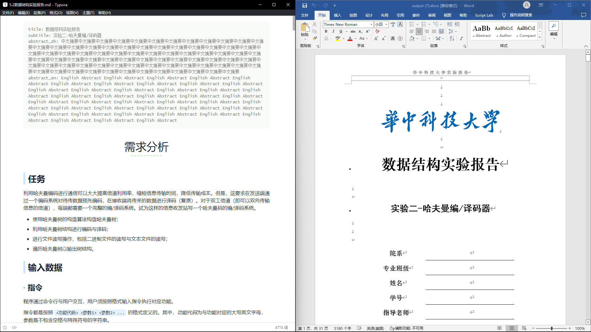

# md2report

一个用于将Markdown文件转换为可以直接提交给学校的实验报告/大作业报告/期末小论文的工具。

如果你的院系/课程要求必须提交docx格式的报告，并且：
  - 你认为word/docx实在是太蠢了，并且习惯于使用markdown编辑文档，md2report能够大幅缩短你在报告格式、docx样式以及排版上花费的时间；
  - 你没有试过使用markdown，不妨尝试一下: [Markdown Guides](https://www.markdownguide.org/), [Mardown 教程](https://markdown.com.cn/)；

如果你的院系/课程允许提交pdf格式的报告，寻找一个好用的tex模板或许是一个更好的方案。但是考虑到学习成本以及使用难度，md2report仍然可以作为一个替代选项。

[预览更多](https://woolen-sheep.github.io/md2report/preview/)



## Quick Start

虽然md2report使用的都是标准markdown语法，但是markdown标记到docx的样式映射可能与你的习惯不同。
因此，请确保除了本小节内容以外，开始使用md2report之前先阅读文档中关于[语法](https://woolen-sheep.github.io/md2report/grammar/)的部分。

### Web UI

md2report提供了[Web UI](https://md2report.hust.online), 无需安装即可使用。

### CLI

md2report提供了CLI，如果想使用CLI，需要：

- python 3.10+
- poetry in PATH
- pandoc in PATH
- [Git LFS](https://git-lfs.github.com/) installed

```bash 
git clone https://github.com/woolen-sheep/md2report.git 
cd backend
poetry install
poetry shell

python md2report.py -h
# usage: md2report.py [-h] [-c CONFIG] [--highlight HIGHLIGHT] [-o OUTPUT] -i INPUT [-t TEMPLATE]
#
# options:
#   -h, --help            show this help message and exit
#   -c CONFIG, --config CONFIG
#                         config file path
#   --highlight HIGHLIGHT
#                         enable highlight of code blocks
#   -o OUTPUT, --output OUTPUT
#                         output docx filename
#   -i INPUT, --input INPUT
#                         input markdown filename
#   -t TEMPLATE, --template TEMPLATE
#                         template to use
#   --indent-font-size INDENT_FONT_SIZE
#                         first line indent font size in pt
#   --indent-font-num INDENT_FONT_NUM
#                         first line indent num
#   --first_line_indent FIRST_LINE_INDENT
                        enable the first line indent

python md2report.py -i test/test_case/5.2数据结构实验报告.md

# see output.docx

```

### Docker

```bash
docker run --name md2report -d woolensheep/md2report:latest
```

此docker为 `backend/Dockerfile` build 产物，无法作为完整的前后端使用。但是你可以进入其中运行CLI而无需搭建环境：

```bash
➜  no-more-docx-report git:(master) ✗ docker exec -it md2report bash
root@f35bd61ef8bc:/app# python md2report.py -h
usage: md2report.py [-h] [-c CONFIG] [--highlight HIGHLIGHT] [-o OUTPUT] -i INPUT [-t TEMPLATE]

options:
  -h, --help            show this help message and exit
  -c CONFIG, --config CONFIG
                        config file path
  --highlight HIGHLIGHT
                        enable highlight of code blocks
  -o OUTPUT, --output OUTPUT
                        output docx filename
  -i INPUT, --input INPUT
                        input markdown filename
  -t TEMPLATE, --template TEMPLATE
                        template to use
  --first_line_indent FIRST_LINE_INDENT
                        enable the first line indent
```

### Self-Hosted Web UI

md2docx的Web UI也是开源的，你可以使用docker-compose部署。
需要注意的是现在的`docker-compose.yaml`中挂载了绝对路径，使用之前请先修改。

```bash
cd backend
docker compose up --build -d
docker compose ps
```

## Features

目前支持的特性如下：

- [x] Title and SubTitle
- [x] Abstract
- [x] Heading (H1 to H4)
- [x] Image Caption
- [x] Table
- [x] Table Caption
- [x] Code Highlight
- [x] Table of Content
- [x] Header and Footer
- [x] First line indent
- [x] Page Numbering
  - [ ] Skip numbering of TOC and Abstract
- [x] Template of Specific School
  - [x] HUST
    - [x] School Logo
    - [x] Student Infomation

由于依赖了pandoc，除了以上内容，pandoc原生支持的markdown语法也应该正常工作。

## Compatibility

目前仅在MS Office 2019上进行过测试，测试版本为`Microsoft® Word 2019MSO (版本 2210 Build 16.0.15726.20070) 64 位`，能够正常打开生成的文档。
打开文档时若提示`是否更新文档中的这些域？`，请选择`是`。另存文件可以消除该提示。

## Contribute

在open issue之前请先阅读[提问的智慧](https://github.com/ryanhanwu/How-To-Ask-Questions-The-Smart-Way/blob/main/README-zh_CN.md)。

我不确定是否只有我所在的学校存在报告过多的现象，或者这是一个普遍的现象。如果你有同样的困扰，可以开PR来补充你们学校的template。
