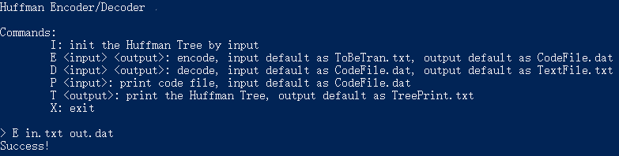
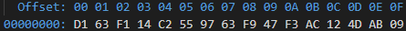
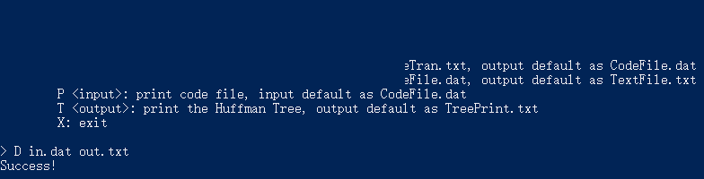
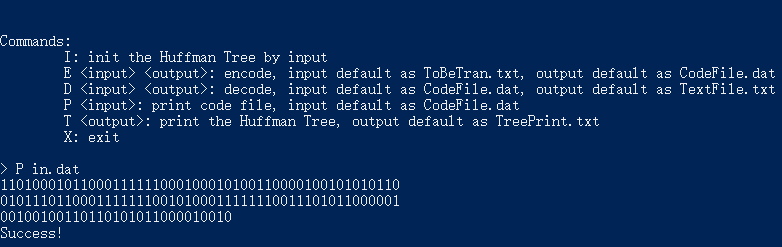
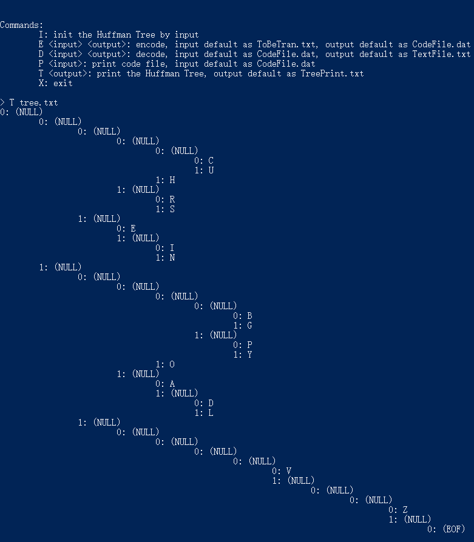
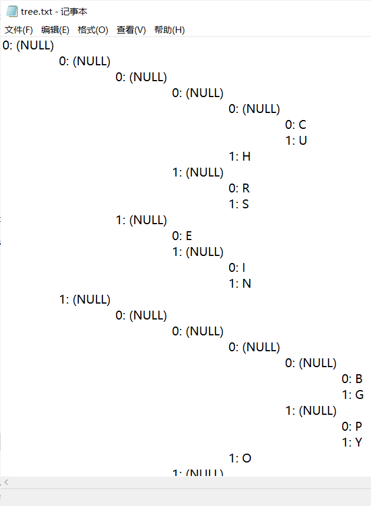

# 需求分析

## 任务

利用哈夫曼编码进行通信可以大大提高信道利用率，缩短信息传输时间，降低传输成本。但是，这要求在发送端通过一个编码系统对待传数据预先编码，在接收端将传来的数据进行译码（复原）。对于双工信道（即可以双向传输信息的信道），每端都需要一个完整的编/译码系统。试为这样的信息收发站写一个哈夫曼码的编/译码系统。

- 使用哈夫曼树的构造算法构造哈夫曼树；
- 利用哈夫曼树结构进行编码与译码；
- 进行文件读写操作，包括二进制文件的读写与文本文件的读写；
- 遍历哈夫曼树以输出树结构。

## 输入数据

### 指令

程序通过命令行与用户交互，用户须按照格式输入指令执行对应功能。

指令都是按照 `<功能代码> <参数1> <参数2> ...` 的格式定义的。其中，*功能代码*为与功能对应的大写英文字母，参数是不包含空格与特殊符号的字符串。

### 字符集与频度

当需要从命令行输入字符集与频度构建哈夫曼树时，输入的字符集大小不应超过 100。输入时，每一行需要符合 `<字符> <频度>` 格式，其中频度是不超过 $10^{16}$ 的非负整数。输入结束时，输入一行空行来表示终止输入。

为了输入换行符、空格等非图形字符，可以使用转义序列代替特殊字符，支持的转义序列如下表所示：

#table 转义序列表

| **字符** | **转义序列** | **描述**      |
| -------- | ------------ | ------------- |
| `\x0A`   | `\n`         | 换行符（LF）  |
| `\x20`   | `\b`         | 半角空格      |
| `\x09`   | `\t`         | 制表符（Tab） |

### 编码文本与译码数据

编码与译码的数据直接从用户指定的文件中读取。

## 输出数据

### 编码结果与译码结果

编码与译码的结果直接写入用户指定的文件中，除编译码数据自带的空行外，文件末尾不会增加空行。

### 哈夫曼树

输出哈夫曼树结构时，使用了凹入表的模式，凹入表每行按照层次缩进，除缩进以外的部分符合格式 `<0/1>: <字符>`，其中的 0/1 代表为左儿子或右儿子。若结点上无字符，输出 `(NULL)`；若结点字符为文件终止符，输出 `(EOF)`。

# 概要设计

## 数据结构

### 哈夫曼树

哈夫曼树结点类名为 `HfmTreeNode`，包含三个 public 成员变量：

| **变量名** | **类型**        | **描述**                                                       |
| ---------- | --------------- | -------------------------------------------------------------- |
| ch         | `char`          | 节点上的字符，若为文件终止符值为 `char(-1)`，若无字符值为 `\0` |
| lch        | `HfmTreeNode *` | 左儿子指针，若无左儿子值为 `nullptr`                           |
| rch        | `HfmTreeNode *` | 右儿子指针，若无右儿子值为 `nullptr`                           |

哈夫曼树类名为 `HfmTree`，包含一个用于二进制序列化树结构的 `private` 结构体类型 `DataUnion`，包含一个 `public` 变量 `root` 指针指向树根结点，实现了构造函数与析构函数，其他 `public` 成员函数定义见下表：

| **函数名** | **参数列表**                                  | **返回值类型** | **描述**                                               |
| ---------- | --------------------------------------------- | -------------- | ------------------------------------------------------ |
| init       | （空）                                        | `void`         | 从二进制文件中读取数据初始化哈夫曼树                   |
| init       | `std::map<char, double> &charset`             | `void`         | 从给定字符集初始化哈夫曼树                             |
| save       | （空）                                        | `void`         | 将当前哈夫曼树结构二进制序列化并写入文件               |
| print      | `const std::string &output = "TreePrint.txt"` | `void`         | 以凹入表形式输出当前哈夫曼树结构，并将输入内容写入文件 |

### 优先队列/堆

实现哈夫曼树的构造算法时使用了优先队列/堆，该数据结构使用了 STL 中的大根堆实现 `std::priority_queue<std::pair<double, HfmTreeNode *>, std::vector<std::pair<double, HfmTreeNode *>>, std::greater<>>`，其定义参见 https://zh.cppreference.com/w/cpp/container/priority_queue。

### 队列

实现从文件读取哈夫曼树结构、将结构写入文件与析构函数时使用了队列，该数据结构使用了 STL 中的单端队列实现 `std::queue<HfmTreeNode *>`，其定义参见 https://zh.cppreference.com/w/cpp/container/queue。

## 编码/解码器

编码/解码器类名为 `EnDecoder`，包含两个 `private` 成员变量：

| **变量名** | **类型**                                        | **描述**             |
| ---------- | ----------------------------------------------- | -------------------- |
| tree       | `HfmTree`                                       | 编解码使用的哈夫曼树 |
| mp         | `std::map<char, std::pair<uint16_t, uint16_t>>` | 缓存每个字符对应     |

构造器接受一个参数 `const HfmTree &_tree`，该参数提供了编解码使用的哈夫曼树。该类同时包含三个 `public` 成员函数：

| **函数名** | **参数列表**                                                                            | **返回值类型** | **描述**                   |
| ---------- | --------------------------------------------------------------------------------------- | -------------- | -------------------------- |
| encode     | `const std::string &input = "ToBeTran.txt", const std::string &output = "CodeFile.dat"` | `void`         | 根据用户指定的文件进行编码 |
| decode     | `const std::string &input = "CodeFile.dat", const std::string &output = "TextFile.txt"` | `void`         | 根据用户指定的文件进行解码 |
| print_code | （空）                                                                                  | `void`         | 输出用户指定文件中的编码   |

## 异常

程序在遇到错误时以抛出异常的方式处理，因此自定义了异常类型 `ExpException`，`public` 继承 STL 的异常基类 `std::exception`。构造器接收异常信息参数 `std::string _msg`，该信息在 `what()` 成员函数中被展示。

## 主程序

主程序的流程如下：

1. 检查是否有记录哈夫曼树结构的文件，若有则从文件初始化哈夫曼树，否则要求用户从命令行输入字符集与频度信息并初始化哈夫曼树；
2. 初始化编码/解码器；
3. 输出程序帮助信息；
4. 读取与解析指令，按照指令调用对应功能执行。

# 详细设计

以下内容省略了一部分非核心设计的细节伪代码，仅保留了核心部分的伪代码。

## 哈夫曼树

### 从字符集构建哈夫曼树

```cpp
void InitHfmTree(HfmTree *tree, Charset charset) {
    // 检查字符集是否合法
    if (!HasChar(charset, EOF)) InsertChar(charset, EOF, 0);
    if (charset.size > CHARSET_SIZE_MAX) throw ...;

    // 利用优先队列/堆构建哈夫曼树
    PriorityQueue pq;
    for (Char c : charset) {
        // 创建每个字符对应的叶子结点
        HfmTreeNode *p;
        NewNode(&p);
        p->ch = c.ch;
        p->lch = p->rch = nullptr;
        EnQueue(&pq, Pair(c.freq, p));
    }
    while (pq.size > 1) {
        // 取出队列中频率最小的两个结点，将其接至同一个父结点，设置父结点频度为两儿子之和，将父结点放回队列
        Pair p1, p2;
        DeQueue(&pq, &p1);
        DeQueue(&pq, &p2);
        HfmTreeNode *p;
        p->ch = 0;
        p->lch = p1.p;
        p->rch = p2.p;
        EnQueue(&pq, Pair(p1.freq + p2.freq, p));
    }
    // 队列中最后剩下的结点为哈夫曼树的根结点
    Pair p;
    DeQueue(&pq, &p);
    tree->root = p.p;

    // 将构建完成的哈夫曼树写入文件
    SaveHfmTree(tree);
}
```

### 将哈夫曼树结构写入文件

```cpp
void SaveHfmTree(HfmTree *tree) {
    // 打开文件
    File f;
    OpenFile(&f, "hfmTree.dat", BINARY_FILE);

    // 初始化用于遍历哈夫曼树的队列
    Queue q;
    InitQueue(&q);
    EnQueue(&q, tree.root);

    DataUnion dat; // 二进制序列化遍历的结构体
    int tail_idx = 1; // 队列尾元素的编号，从 1 开始编号
    while (!QueueEmpty(q)) {
        HfmTreeNode *p;
        DeQueue(&q, &p);
        // 二进制序列化
        dat.ch = p->ch;
        if (p->lch != nullptr) {
            dat.lch = ++tail;
            EnQueue(&p, p->lch);
        } else {
            dat.lch = 0;
        }
        if (p->rch != nullptr) {
            dat.rch = ++tail;
            EnQueue(&p, p->rch);
        } else {
            dat.rch = 0;
        }
        // 将序列化后的结果写入文件
        WriteFile(f, dat);
    }

    CloseFile(f);
}
```

### 从文件中读取哈夫曼树结构

```cpp
void InitHfmTree(HfmTree *tree) {
    // 打开文件
    if (!FileExists("hfmTree.dat")) throw ...;
    File f;
    OpenFile(&f, "hfmTree.dat", BINARY_FILE);

    // 从文件中读取哈夫曼树结构信息
    Array nodes;
    DataUnion dat;
    while (ReadFile(f, &dat)) {
        HfmTreeNode *p;
        NewNode(&p);
        AppendArray(&nodes, dat, p);
    }
    CloseFile(f);

    // 恢复哈夫曼树结构
    if (ArrayEmpty(nodes)) throw ...;
    for (DataUnion dat, HfmTreeNode *p : nodes) {
        if (!ValidIndex(dat.lch) || !ValidIndex(dat.rch)) throw ...;
        p->ch = dat.ch;
        p->lch = p->rch = nullptr;
        // 根据儿子的编号建立到儿子的指针
        if (dat.lch > 0) p->lch = nodes[dat.lch - 1].p;
        if (dat.rch > 0) p->rch = nodes[dat.rch - 1].p;
    }
    tree->root = nodes[0].p;
}
```

### 输出树结构

```cpp
void PrintHfmTree(HfmTreeNode *p, int num, int dep) {
    // 按凹入表格式递归输出树结构
    for (int i = 0; i < dep; i++) Write('\t'); // 缩进
    Write(char(num + '0') + ": "); // 左右儿子标记
    if (IsLeafNode(p)) {
        // 如果为叶子结点，输出记录的字符
        if (p->ch == EOF) Write("(EOF)");
        else Write(p->ch);
    } else {
        Write("(NULL)");
    }
    if (p->lch != nullptr) PrintHfmTree(p->lch, 0, dep + 1);
    if (p->rch != nullptr) PrintHfmTree(p->rch, 1, dep + 1);
}
```

## 编码/解码器

### 编码

```cpp
void Encode(EnDecoder endecoder, File in, File out) {
    // 编码输入数据，并写入输出文件中
    while (!FileEOF(in)) {
        char c;
        ReadChar(in, &c);
        if (!MapFind(endecoder.mp, c)) throw ...;
        Write(out, endecoder.mp[c]); // 在实现时使用了 buffer，实际细节比伪代码多
    }
    CloseFile(in);
    CloseFile(out);
}
```

### 解码

```cpp
void Decode(EnDecoder endecoder, File in, File out) {
    // 解码输入数据，并写入输出文件中
    HfmTreeNode *p = endecoder.tree->root;
    while (!FileEOF(out)) {
        int t;
        ReadBit(in, &t);
        // 根据编码的 0/1 判断应该向左儿子或右儿子走
        if (t == 0) p = p->lch;
        else p = p->rch;
        if (p == nullptr) throw ...;
        if (IsLeafNode(p)) {
            // 到达叶子节点说明一个字符解码完成
            if (p->ch == EOF) break;
            Write(out, p->ch); // 在实现时使用了 buffer，实际细节比伪代码多
            p = tree->root;
        }
    }
    CloseFile(in);
    CloseFile(out);
}
```

### 输出编码

```cpp
void PrintCode(EnDecoder endecoder, File in) {
    // 输出输入文件中的编码
    HfmTreeNode *p = endecoder.tree->root;
    while (!FileEOF(out)) {
        int t;
        ReadBit(in, &t);
        Write(out, char(t + '0'));
        if (t == 0) p = p->lch;
        else p = p->rch;
        if (IsLeafNode(p)) {
            if (p->ch == EOF) break;
            p = tree->root;
        }
    }
    CloseFile(in);
    CloseFile(out);
}
```

## 主程序

```cpp
int main() {
    // 初始化哈夫曼树
    if (!FileExists("hfmTree.dat")) {
        tree = InitHfmTree();
    } else {
        tree->init();
    }

    // 初始化编码/解码器
    EnDecoder endecoder;
    InitEnDecoder(&endecoder, tree);

    // 输出帮助信息
    PrintHelpMsg();
    File in, out;
    while (TRUE) {
        // 读取用户指令，根据指令调用指定功能
        PrintLineHeader();
        Cmd op;
        ReadOp(&op);
        if (op == 'I') {
            tree = InitHfmTree();
        } else if (op == 'E') {
            ProcCmd(&in, &out);
            Encode(endecoder, in, out);
        } else if (op == 'D') {
            ProcCmd(&in, &out);
            Decode(endecoder, in, out);
        } else if (op == 'P') {
            ProcCmd(&in);
            PrintCode(endecoder, in);
        } else if (op == 'T') {
            ProcCmd(&out);
            PrintTree(tree, out);
        } else {
            Print("Unknow command!"); // 未知输入异常
            continue;
        }
        Print("Success!");
    }
    return 0;
}
```

### 函数调用关系


# 调试分析

### 技术细节

- 语言及标准：ISO C++ 17
- 开发环境：JetBrains CLion 2019.3.4
- 编译器：GNU C++ Compiler 9.2.0
- 编译选项：`-Wall -Wextra -O2`
- 生成器：CMake 3.15

### 设计与实现

1. 采用了类似面向对象（Object-Oriented）思想的设计，使功能得到了很好的分类；
2. 使用转义序列代替不好通过键盘输入的特殊字符，解决了输入字符集的问题；
3. 灵活运用 C++ 新特性，如 lambda 表达式、自动类型推断等，使编码更简单；
4. 采用了自定义指令的交互方式，使交互更便捷；
5. 采用了基于异常处理的错误处理方式；
6. 进行了许多边界与不合法状况的检查，避免错误数据造成程序作出异常行为。

### 时空分析

#### 时间复杂度

##### 哈夫曼树的构造

用 $n$ 代表字符集的大小，由于使用了数据结构堆，其单次操作的复杂度为 $O(\log n)$，因此总时间复杂度为 $O(n \log n)$。

##### 编码与解码

用 $n$ 代表编码/解码数据长度，

- 在编码时，每次查询到该字符的编码并拼接，单次复杂度为 $O(1)$，总复杂度为 $O(n)$；
- 在解码时，每次读到一位 0/1 都在哈夫曼树上向儿子走一步，单次复杂度为 $O(1)$，总复杂度为 $O(n)$。

#### 空间复杂度

##### 哈夫曼树

用 $n$ 代表字符集大小，根据构造算法，每次提取两个结点的同时新建一个结点，最终的结点数规模为 $O(n)$，因此空间复杂度为 $O(n)$。

##### 编码与解码

用 $n$ 代表编码/解码数据长度，$k$ 代表字符集大小：

- 在编码时，期望情况下树高为 $O(\log k)$ 规模的，因此总空间复杂度为 $O(n \log k)$，而最坏情况下可以达到 $O(nk)$；
- 在解码时，由于解码是编码的逆运算，易得期望情况下的复杂度为 $O(n \log^{-1} k)$，最坏情况下的复杂度为 $O(n)$。

### 问题与经验

1. 未注意到端序对变量存储的影响，这个错误使二进制序列化得到了错误的结果，通过学习端序、采用结构体二进制序列化解决了问题，并学习了 C++ 关键字 `reinterpret_cast` 的使用；
2. `getline` 输入函数会读入多余空行，导致输入数据为空的问题，通过多次读入消耗掉空行解决了问题；
3. 未使用二进制文件模式打开文件，使文件中多出了一些换行符，干扰了二进制序列化的数据，改用二进制文件模式解决了问题；
4. 在手动处理 buffer 读写的过程中出现了位运算的使用错误，通过系统检查修正了错误，并且加深了对位运算的学习与理解；
5. 错误使用了流函数 `readsome`，用 `read` 函数替换解决了该问题，说明对 STL 流输入输出的使用不够熟练，需要多加学习；
6. 在析构 `EnDecoder` 对象时也会析构对象内部的 `HfmTree` 对象，因此不应重复析构 `HfmTree` 对象，此处的问题导致了程序的异常行为，修复该问题加深了对析构特性的理解。

# **五、用户使用说明**

实验使用的二进制可执行文件为 `exp52.exe`（Linux 下为 `exp52`），用户通过命令行输入指令进行交互。

## 初次使用

初次使用时，程序会显示以下信息提醒输入字符集与频数以初始化哈夫曼树，按照提示中的格式输入字符集并以空行结束输入即可。


输入字符集示例如下图所示。


## 编码

先将待编码信息写入文本文件中，然后使用指令 `E <input> <output>` 进行编码，如图所示。




示例指令运行完毕后，可以在 `out.dat` 中找到编码后的数据，如图所示。



## 解码

先将待编码信息保存在指定文件中，然后使用指令 `D <input> <output>` 进行解码，如图所示。



示例指令运行完毕后，可以在 `out.txt` 中找到解码后的数据，如图所示。


## 输出编码结果

使用指令 `P <input>` 输出编码，如图所示。



## 输出哈夫曼树

使用指令 `T <output>` 输出哈夫曼树结构，如图所示。





## 退出程序

输入指令 `X` 退出程序。

# 测试结果

以下测试结果皆为对程序的正确性校验结果。

## 数据 1

**输入：**

```
(Encode)
THIS PROGRAM IS MY FAVORITE
```

**输出：**

```
11010001011000111111000100010100110000100101010110
01011101100011111110010100011111110011101011000001
00100100110110101011000010010
```

## 数据 2

**输入：**

```
(Decode)
11010001011000111111000100010100110000100101010110
01011101100011111110010100011111110011101011000001
00100100110110101011000010010
```

**输出：**

```
THIS PROGRAM IS MY FAVORITE
```

## 数据 3

**输入：**

```
(Encode)
ON APRIL FIRST PRESIDENT XI JINPING INSTRUCTED GOVERNMENT OFFICIALS TO TAKE MORE MEASURES TO COORDINATE DISEASE PREVENTION AND THE RESUMPTION OF ECONOMIC PRODUCTION IN AN EFFORT TO FULFILL THIS YEARS DEVELOPMENT GOALS DURING HIS FOUR DAY INSPECTION TRIP TO ZHEJIANG PROVINCE
```

**输出：**

```
10010111111101010001000100110101111111100110110001
00011110111110001000100100011011010110010011111011
11110000101101101111100001001101100111100010011001
11100001111011001110011110100100000100000110101010
11011110000110011100000010001001111100100100111110
11111001110011110011011000000011010101011100111111
10110011111101101011000011010111110010100100100101
11110010010101000110000100100100011111110110011110
00001001100100101011001100111101011010101111011001
10001101010100011010111100010001001011000000100111
11010110100101111111010011110110111110100010101110
01001000110000111001010001011010110100101111111001
11001111101000000100101111001110010011000000111100
01000101001101100000100000110101101001011111101100
11111110100111111010110011110011100100101101111110
11001111110011000011011111001101101011110111111110
10001011000111111000110101010001000111111011001011
00000010101111001100010110010010011111011111000011
00110101011100111111011000001001001100111100001111
00010110001111111001110010000100101111011010101000
11111011001110011100010010000001101011010010111111
11010010011010001011111011001111110000100000010101
10000100110110101001111000011111000100010100111000
00011001110000001010010010110111111011001111110011
00001101111100110110101111011111111010001011000111
1110001101010100010001111111000010010
```

## 数据 4

**输入：**

```
(Decode)
01010100010010000100010100100000010011100100111101
01011001000101010011000010000001000011010011110101
00100100111101001110010000010101011001001001010100
10010101010101001100100000010100000100000101001110
01000100010001010100110101001001010000110010000001
00100101010011001000000101010001001000010001010010
00000101001101000101010101100100010101010010010001
01010100110101010000100000010000110101001001001001
01010011010010010101001100100000010101000100100001
00010100100000010101110100111101010010010011000100
01000010000001001000010000010101001100100000010001
10010000010100001101000101010001000010000001010100
01001000010010010101001100100000010000110100010101
00111001010100010101010101001001011001001000000101
01110100111101010010010100110100010100100000010101
00010010000100000101001110001000000101010001001000
01000101001000000100011101001100010011110100001001
00000101001100001000000100011001001001010011100100
00010100111001000011010010010100000101001100001000
00010000110101001001001001010100110100100101010011
00100000010101000100100001000001010101000010000001
01010001001000010001010010000001000111010011000100
11110100001001000001010011000010000001010000010101
01010000100100110001001001010000110010000001001000
01000101010000010100110001010100010010000010000001
00010101001101010001010101001001000111010001010100
11100100001101011001001000000100001101000001010011
10001000000100011101001001010101100100010100100000
01010010010010010101001101000101001000000101010001
00111100100000010000010010000001001000010011110101
00110101010000100000010011110100011000100000010000
11010100100100100101010011010001010101001100100000
01001001010011100100001101001100010101010100010001
00100101001110010001110010000001000101010000110100
11110100111001001111010011010100100101000011001000
00010100110100111101000011010010010100000101001100
00100000010000010100111001000100001000000101000001
00111101001100010010010101010001001001010000110100
00010100110000100000010000110101001001001001010100
11010001010101001100100000010001110100100101010110
01000101010011100010000001001001010101000101001100
10000001001000010101010100011101000101001000000100
10010100110101010000010000010100001101010100001000
00010011110100111000100000010101000100100001000101
00100000010001110100110001001111010000100100000101
00110000100000010100110101010101010000010100000100
11000101100100100000010010010100111001000100010101
01010100110101010001010010010010010100000101001100
00100000010000010100111001000100001000000101011001
00000101001100010101010100010100100000010000110100
10000100000101001001010011100101001100100000010100
11010010000100111101010101010011000100010000100000
01000111010010010101011001000101001000000100000101
00111000100000010010010100010001000101010000010010
00000100000101000010010011110101010101010100001000
00010010010101010001010011001000000100010001001001
01010010010001010010000001001100010011110100111001
00011100100000010101000100010101010010010011010010
00000100010101000110010001100100010101000011010101
00010100110100111000100000010101000100100001000101
00100000010001110100110001001111010000100100000101
00110000100000010100110101010101010000010100000100
11000101100100100000010010010100111001000100010101
01010100110101010001010010010010010100000101001100
```

**输出：**

```
THE NOVEL CORONAVIRUS PANDEMIC IS THE SEVEREST CRISIS THE WORLD HAS FACED THIS CENTURY WORSE THAN THE GLOBAL FINANCIAL CRISIS THAT THE GLOBAL PUBLIC HEALTH EMERGENCY CAN GIVE RISE TO A HOST OF CRISES INCLUDING ECONOMIC SOCIAL AND POLITICAL CRISES GIVEN ITS HUGE IMPACT ON THE GLOBAL SUPPLY INDUSTRIAL AND VALUE CHAINS SHOULD GIVE AN IDEA ABOUT ITS DIRE LONG TERM EFFECTS
```

## 数据 5

对程序代码 `main.cpp` 进行字符统计与编码，编码文件为 `main_cpp.dat`。

## 数据 6

输出根据字符集

```
\b 186
A 64
B 13
C 22
D 32
E 103
F 21
G 15
H 47
I 57
J 1
K 5
L 32
M 20
N 57
O 63
P 15
Q 1
R 48
S 51
T 80
U 23
V 8
W 18
X 1
Y 16
Z 1
```

构造的哈夫曼树，输出文件见 `tree_test.txt`。

# 附录

实验报告文件清单：

| 文件名                   | 描述                                      |
| ------------------------ | ----------------------------------------- |
| 5.2 数据结构实验报告.pdf | 实验报告文档                              |
| 5.2 数据结构实验报告.md  | 实验报告 Markdown 源文件                  |
| exp52.exe                | Windows 下的二进制可执行实验程序          |
| main_cpp.dat             | 测试 5 的输出文件                         |
| tree_test.txt            | 测试 6 的输出文件                         |
| gen_charset.cpp          | 用于统计文本文档中字符集的工具 C++ 源文件 |
| code/CMakeList.txt       | CMake 配置文件                            |
| code/main.cpp            | 主程序源文件                              |
| code/coding.h            | 编码部分头文件                            |
| code/coding.cpp          | 编码部分源文件                            |
| code/common.h            | 常量配置部分头文件                        |
| code/common.cpp          | 常量配置部分源文件                        |
| code/except.h            | 异常部分头文件                            |
| code/hfmtree.h           | 哈夫曼树部分头文件                        |
| code/hfmtree.cpp         | 哈夫曼树部分源文件                        |
